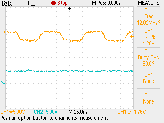

## Arduino testing and setup 

- Windows 11 needed to fix the driver: refer [here](https://support.arduino.cc/hc/en-us/articles/13148652511260-avrdude-ser-open-can-t-set-com-state-for-COMn)

## Arduino pinout

---
## Si 5351 testing 
- Found a usable [library]()
- i2c_scanner showed `0x60` as a detected address
- Used the test code to generate a 12 MHz signal 
	- Measured signal was not showing a prefect square wave. 
	- This might be just stray capacitance in the system. routing the signal with a small coax might fix the isser
	
	

---

## Filter evaluation 

- The current BPF seems to be working as expected 
- Testing the output after the filter with an RTL SDR
	