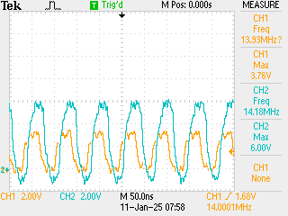

# Signal amplification 
## Testing 7400

- The signal was properly amplified and the frequency is held steady
- the clock signal is distorted out potentially due to the testing setup
- Input `clk0` and the output after 2 not gates are shown 
	
